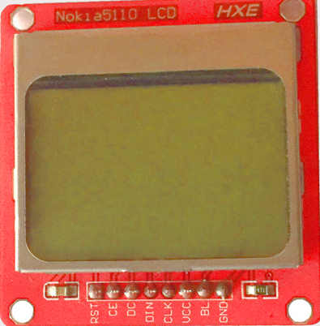
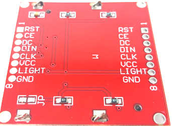
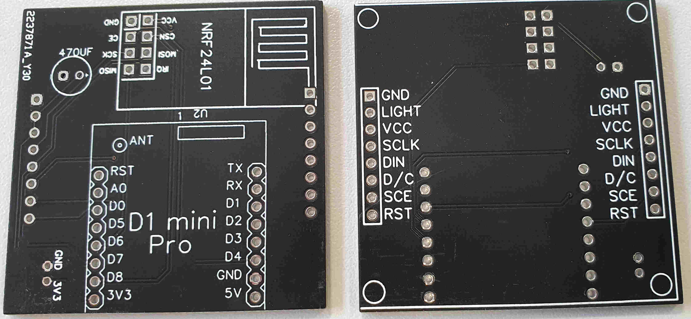
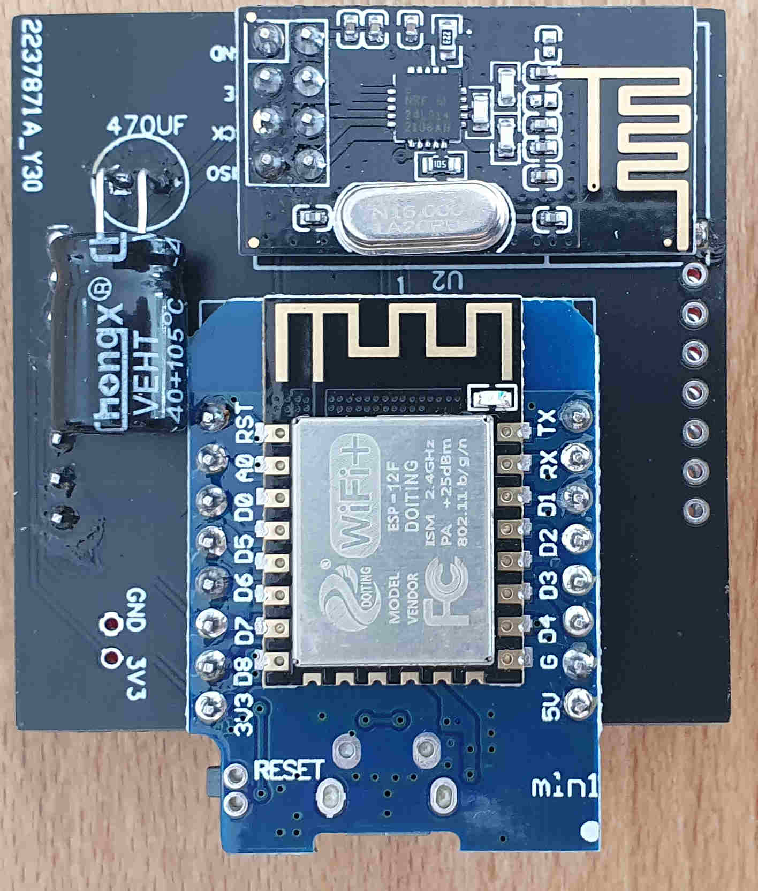
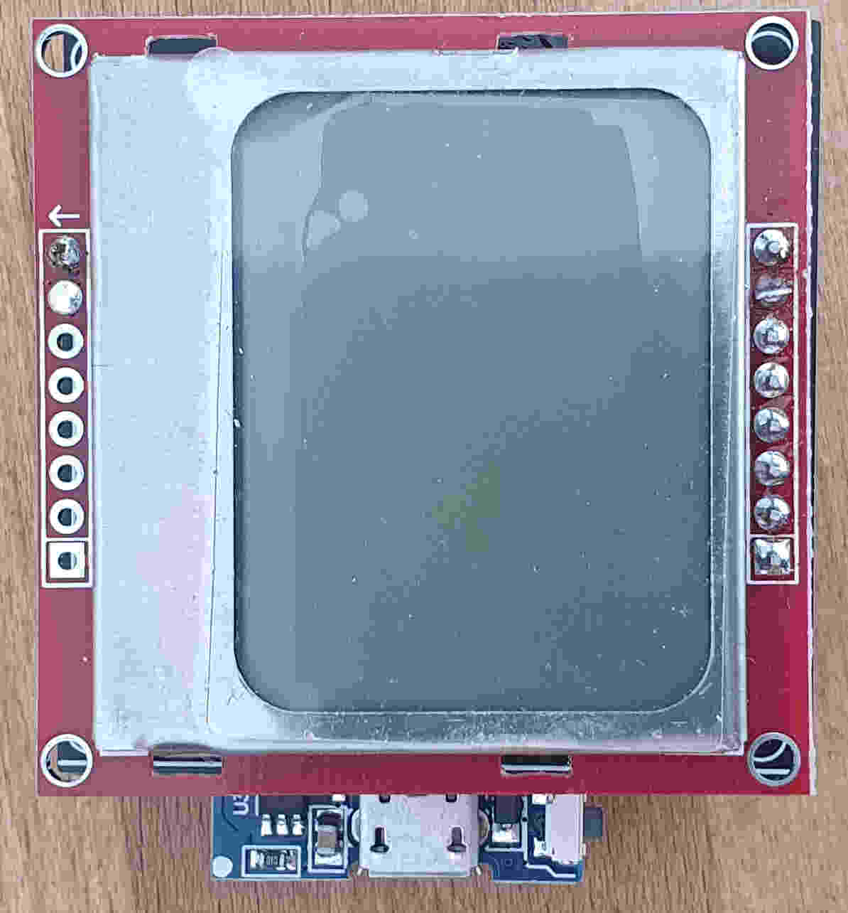
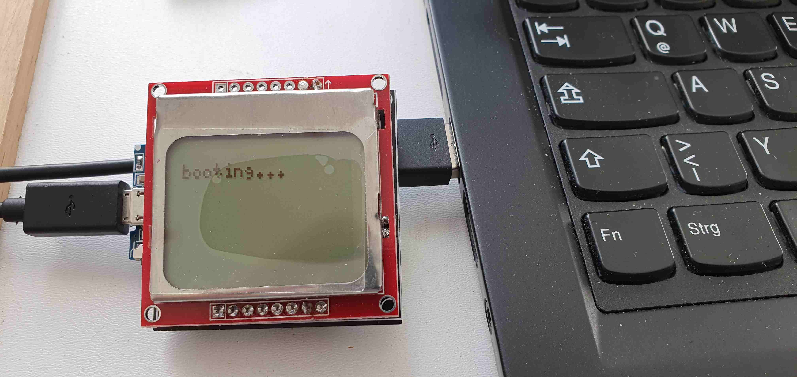
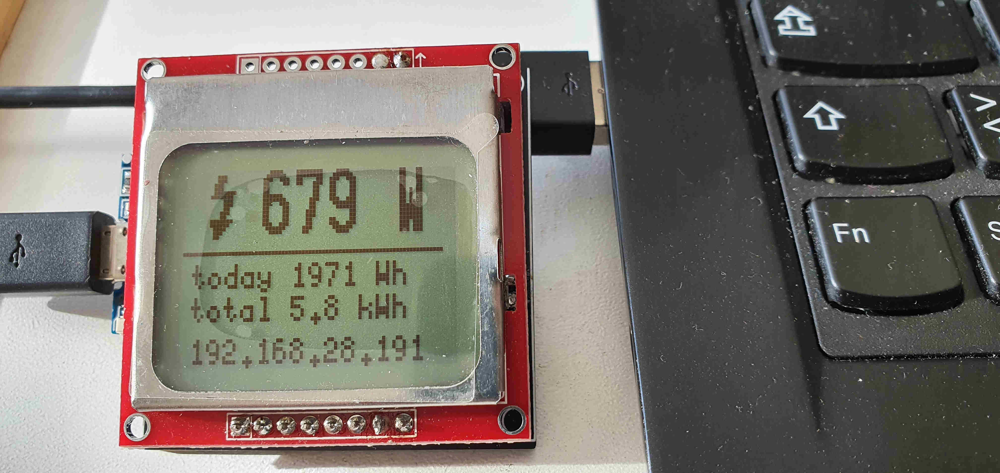
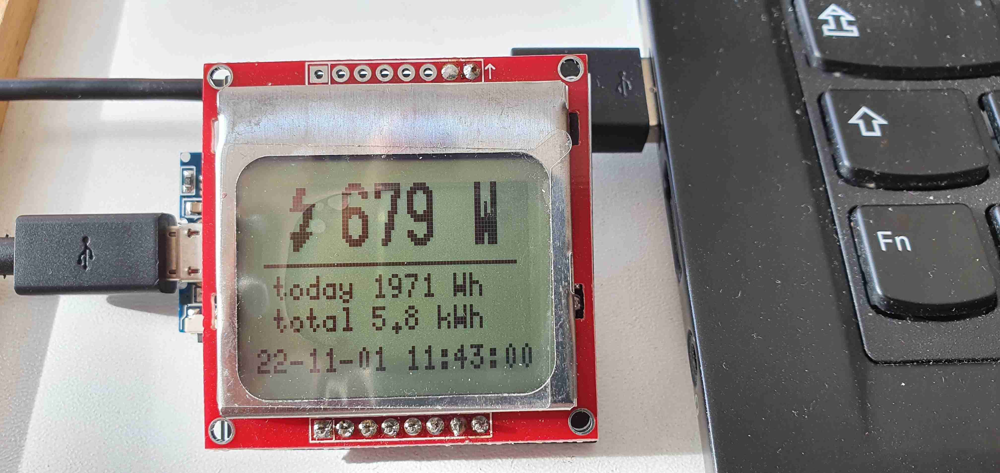
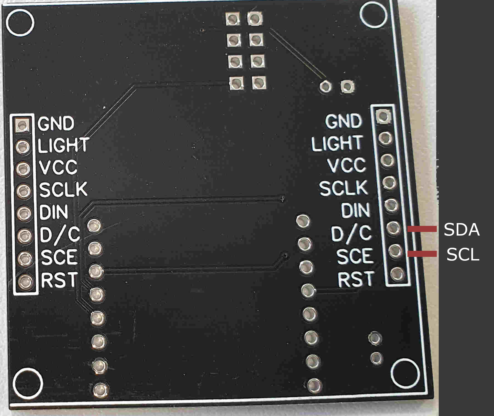

# PCB for Wemos D1 + Nokia5110-display + nRF24L01+

Simple pcb to plug a nRF24L01+ together with a Wemos D1 Mini / Pro and a NOKIA5110-display (known as PCD8544).
One goal :  You can power this pcb via USB-interface of D1-mini.

attached zip was created with easyeda. You can order easyly on jlcpcb.com.

## Attention
Be sure you have the right type of nokia-display-pcb !
Check pin-header-description (There are different versions avail)!
( check picture : LIGHT (or BL) is placed between GND and VCC )

 or 

---

A picture of earlier version of pcb.

D1-mini and NRF placed on front side, nokia display will soldered bottom.
You can use this PCB also without mounting a Nokia-display.

Actual version of PCB has mounting holes and additional 5V/Gnd -pin access.

## after soldering ...

NRF & Wemos on Front

Nokia Display soldered on bottom side

while booting (wait for wifi, 1st data, ...)

1st screen show most interesting info and IP in bottom line

this is the normal screen with time in bottom line (refresh all 5 seconds)

# SSD1306

Some changes made possible to use SSD1306 (instead of NOKIA5110 display).

You can use same PCB. You only have to connect GND (SSD:GND), VCC (SSD:VCC), D/C (SSD:SDA) and SCE (SSD:SCL)

On other PCB-layouts, PIN wemos:D1 need connected to SSD:SCL and wemos:D2 has to be connected to SSD:SDA.
much fun.
